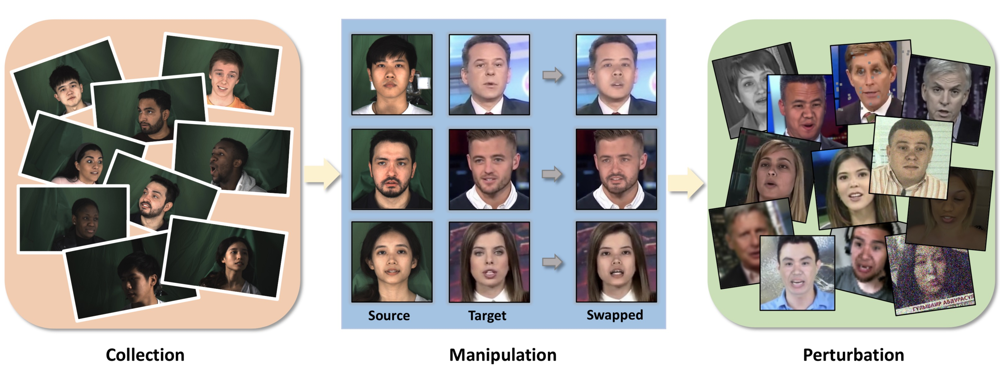
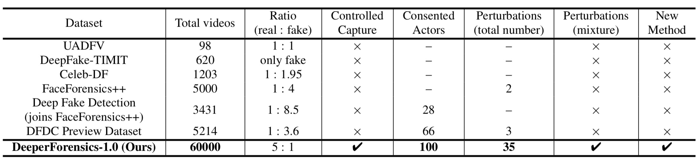
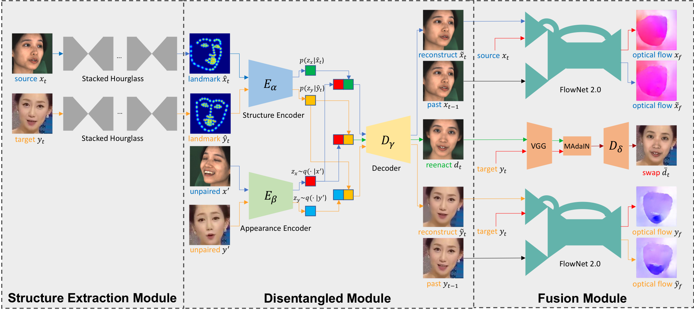
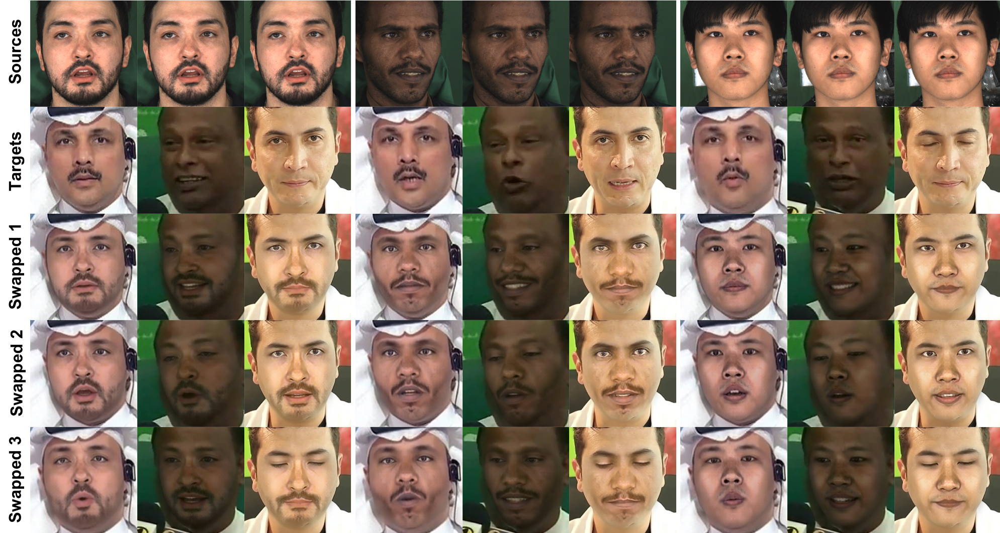

# DeeperForensics-1.0: A Large-Scale Dataset for Real-World Face Forgery Detection



This repository provides the dataset and code for the following paper:

**DeeperForensics-1.0: A Large-Scale Dataset for Real-World Face Forgery Detection**<br>
[Liming Jiang](https://liming-jiang.com/),  [Ren Li](https://liren2515.github.io/page/), [Wayne Wu](http://wywu.github.io), [Chen Qian](https://scholar.google.com/citations?user=AerkT0YAAAAJ&hl=en)  and [Chen Change Loy](http://personal.ie.cuhk.edu.hk/~ccloy/)<br>
In CVPR 2020.<br>
[**Project Page**](https://liming-jiang.com/projects/DrF1/DrF1.html) |   [**Paper**](https://arxiv.org/abs/2001.03024) | [**YouTube Demo**](https://www.youtube.com/watch?v=b6iKqkJht38)
> **Abstract:** *We present our on-going effort of constructing a large-scale benchmark for face forgery detection. The first version of this benchmark, DeeperForensics-1.0, represents the largest face forgery detection dataset by far, with 60,000 videos constituted by a total of 17.6 million frames, 10 times larger than existing datasets of the same kind. Extensive real-world perturbations are applied to obtain a more challenging benchmark of larger scale and higher diversity. All source videos in DeeperForensics-1.0 are carefully collected, and fake videos are generated by a newly proposed end-to-end face swapping framework. The quality of generated videos outperforms those in existing datasets, validated by user studies. The benchmark features a hidden test set, which contains manipulated videos achieving high deceptive scores in human evaluations. We further contribute a comprehensive study that evaluates five representative detection baselines and make a thorough analysis of different settings.*



## Updates
- [02/2021] The [technical report](https://arxiv.org/abs/2102.09471) of DeeperForensics Challenge 2020 is released on arXiv.

- [08/2020] The [**DeeperForensics Challenge 2020**](https://competitions.codalab.org/competitions/25228) starts together with [ECCV 2020 SenseHuman Workshop](https://sense-human.github.io/index_2020.html).

- [05/2020] The [perturbation codes](./perturbation) of DeeperForensics-1.0 are **released**.

- [05/2020] The [dataset](./dataset) of DeeperForensics-1.0 is **released**.

- [02/2020] The [paper](https://arxiv.org/abs/2001.03024) of DeeperForensics-1.0 is accepted by **CVPR 2020**.

## Dataset
DeeperForensics-1.0 dataset has been made **publicly available** for non-commercial research
purposes. Please visit the [dataset download and document page](./dataset) for more details.
Before using DeeperForensics-1.0 dataset for face forgery detection model training,
please read these [important tips](./dataset/README.md#target-videos) first.

## Code
The code to implement the diverse perturbations in our dataset has been **released**. Please
see the [perturbation implementation](./perturbation) for more details.

## Competition
We have hosted [**DeeperForensics Challenge 2020**](https://competitions.codalab.org/competitions/25228) based on the DeeperForensics-1.0 dataset. The challenge officially starts at the [ECCV 2020 SenseHuman Workshop](https://sense-human.github.io/index_2020.html). The prizes of the challenge are a total of $15,000 ([AWS](https://aws.amazon.com/) promotional code). If you are interested in soliciting new ideas to advance state of the art in real-world face forgery detection, we look forward to your participation!

The [technical report](https://arxiv.org/abs/2102.09471) of DeeperForensics Challenge 2020 has been released on arXiv.

## Summary
### Data Collection
We invite 100 paid actors from 26 countries to record the source videos. Our high-quality collected data vary in identities, poses, expressions, emotions, lighting conditions, and 3DMM blendshapes.
<p align="center">
  
</p>

### Face Manipulation
We also propose a new learning-based **many-to-many** face swapping method,
 **DeepFake Variational Auto-Encoder (DF-VAE)**. DF-VAE improves *scalability*,
  *style matching*, and *temporal continuity* to ensure face swapping **quality**.
<p align="center">
  
</p>

Several face manipulation results:
<p align="center">
  
</p>

Many-to-many (three-to-three) face swapping by a **single** model:
<p align="center">
  
</p>

### Real-World Perturbation
We apply 7 types (transmission errors, compression, *etc.*) of distortions
at 5 intensity levels. Some videos are subjected to a mixture of more than
one distortion. These perturbations make DeeperForensics-1.0 better simulate
real-world scenarios.
<p align="center">
  
</p>

### Benchmark
We benchmark five representative forgery detection methods
using the DeeperForensics-1.0 dataset. Please refer to our [paper](https://arxiv.org/abs/2001.03024)
for more information.


## Citation
If you find this work useful for your research, please cite our papers:

```
@inproceedings{jiang2020deeperforensics1,
  title={{DeeperForensics-1.0}: A Large-Scale Dataset for Real-World Face Forgery Detection},
  author={Jiang, Liming and Li, Ren and Wu, Wayne and Qian, Chen and Loy, Chen Change},
  booktitle={CVPR},
  year={2020}
}
```

```
@article{jiang2021dfc20,
  title={{DeeperForensics Challenge 2020} on Real-World Face Forgery Detection: Methods and Results},
  author={Jiang, Liming and Guo, Zhengkui and Wu, Wayne and Liu, Zhaoyang and Liu, Ziwei and Loy, Chen Change and Yang, Shuo and Xiong, Yuanjun and Xia, Wei and Chen, Baoying and Zhuang, Peiyu and Li, Sili and Chen, Shen and Yao, Taiping and Ding, Shouhong and Li, Jilin and Huang, Feiyue and Cao, Liujuan and Ji, Rongrong and Lu, Changlei and Tan, Ganchao},
  journal={arXiv preprint},
  volume={arXiv:2102.09471},
  year={2021}
}
```

## Acknowledgments
This work is supported by the SenseTime-NTU Collaboration Project, Singapore MOE AcRF Tier 1 (2018-T1-002-056), NTU SUG, and NTU NAP. We gratefully acknowledge the exceptional help from Hao Zhu and Keqiang Sun for their contribution on source data collection and coordination.

## Contact
If you have any questions, please contact us by sending an email to
[deeperforensics@gmail.com](mailto:deeperforensics@gmail.com).

## Terms of Use
The use of DeeperForensics-1.0 is bounded by the [Terms of Use: DeeperForensics-1.0 Dataset](./dataset/Terms_of_Use.pdf). \
The code is released under the [MIT license](./perturbation/LICENSE.md).

Copyright (c) 2020
