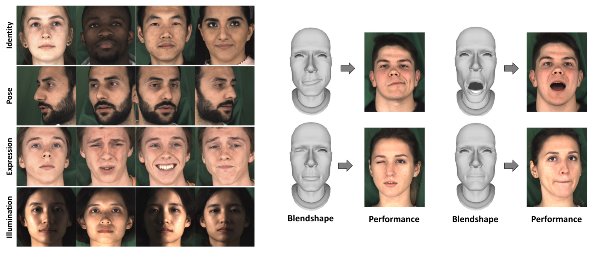

# DeeperForensics-1.0 Dataset

<p align="center"></p>

This is the dataset download and document page for DeeperForensics-1.0.


## Table of Contents
- [Overview](#overview)
- [Space Requirement](#space-requirement)
- [Download](#download)
- [Dataset Structure](#dataset-structure)
- [Documents](#documents)
  - [Source videos](#source-videos)
    - [General](#general)
    - [Identities](#identities)
    - [Illuminations](#illuminations)
    - [Expressions](#expressions)
    - [Poses](#poses)
    - [Source video names](#source-video-names)
    - [Misc](#misc)
  - [Manipulated videos](#manipulated-videos)
    - [General](#general-1)
    - [Raw manipulated videos](#raw-manipulated-videos)
    - [Manipulated videos with perturbations at diverse levels](#manipulated-videos-with-perturbations-at-diverse-levels)
    - [Manipulated videos with mixed perturbations](#manipulated-videos-with-mixed-perturbations)
    - [Manipulation video names](#manipulation-video-names)
    - [Misc](#misc-1)
  - [Target videos](#target-videos)
  - [Lists](#lists)


## Overview
DeeperForensics-1.0, a new dataset for real-world face forgery detection, features
three appealing properties: _good quality_, _large scale_, and _high diversity_.
The full dataset includes **48,475** source videos and **11,000** manipulated videos, an
order of magnitude larger than existing datasets. The source videos are carefully
collected on **100** paid and consented actors from **26** countries, and the manipulated
videos are generated by a newly proposed many-to-many end-to-end face swapping method,
DF-VAE. Besides, **7** types of real-world perturbations at **5** intensity levels are employed
to ensure a larger scale and higher diversity. We will provide some detailed information
as follows. You can also refer to our [paper](https://arxiv.org/abs/2001.03024).


## Space Requirement
* source videos: ~164G
* manipulated videos: ~119G
* lists: ~6.2M
* terms of use: ~56K
* total: ~284G (300G or larger space recommended)


## Download
To download our dataset, please read the [Terms of Use](./Terms_of_Use.pdf)
first and then fill out this [form](https://docs.google.com/forms/d/e/1FAIpQLSe6YIdIjpuL3ACdNjklZNMXXg-1csU02iO4sM7eFwkga0npVg/viewform?usp=sf_link)
(if you have an **educational** email address, _i.e._, \*.edu\*, please use it). The download link will be sent to
you once your request is approved. If you are unable to access the form or have any other questions, please
contact us by sending an email to [deeperforensics@gmail.com](mailto:deeperforensics@gmail.com).


## Dataset Structure
After you download all the files, simply run the script (bash version >= 4) provided in the dataset root:
```bash
bash unzip.sh
```
or manually unzip all the files. It may take a few minutes / hours. After unzipping the files, you will get all the data
in the following folder structure:
```
DeeperForensics-1.0
|--lists
   |--manipulated_videos_distortions_meta
      <several meta files of distortion information in the manipulated videos>
   |--manipulated_videos_lists
      <several lists of the manipulated videos>
   |--source_videos_lists
      <several lists of the source videos>
   |--splits
      <train, val, test data splits for your reference>
|--manipulated_videos
   <11 folders named by the type of variants for the manipulated videos>
|--source_videos
   <100 folders named by the ID of the actors for the source videos, and their subfolders named by the source video information>
|--terms_of_use.pdf
```

## Documents
We will provide some detailed information about DeeperForensics-1.0 dataset. You can also
refer to our [paper](https://arxiv.org/abs/2001.03024) for related information.
### Source videos

<p align="center">
  
</p>

<p align="center">
  
</p>

#### General
* We carefully collect **48,475** source videos in total to improve the _quality_ of our dataset.

* The **resolution** of all the source videos is 1080p: **1920 * 1080**.

* In most cases, we ask the actors to speak naturally to avoid excessive frames that show a closed mouth.

#### Identities
* We invite **100** paid actors from **26** countries to record the source videos. We obtain consents
from all the actors for using and manipulating their faces to avoid the portrait right issues.
The actors have **4** typical skin tones: _white_, _black_, _yellow_, _brown_. Their ages range from
**20** to **45** years old to match the most common age group appearing on real-world videos.

* There are **55** males and **45** females. The actor folder ID starting with 'M' (_e.g._, **M**004) is male,
and the one starting with 'W' (_e.g._, **W**101) indicates female.

* There are **40** Asian actors in the source videos, and another **60** actors are from other parts of
the world. You can also distinguish them by looking at the first digit of the actor ID. If it is '1'
(_e.g._, W**1**01), she is an Asian actor; If it is '0' (_e.g._, M**0**04), he is an actor from other parts of
the world.

#### Illuminations
* The source videos are recorded under **9 lighting conditions**. The lighting subfolder name
`light_<light_direction>` shows the illumination setting. The `<light_direction>` can be:
`down`, `left`, `leftdown`, `leftup`, `right`, `rightdown`, `rightup`, `uniform`, `up`.
Note that the direction `up` means 'top', and `down` indicates 'bottom', in line with our paper.
The `uniform` indicates that illuminations are from all the directions, which are common in our life.

#### Expressions
* The source videos also contain very rich expressions of the actors including **8 emotions**. The
emotion subfolder name `<emotion>` shows them directly:
`neutral`, `happy`, `surprise`, `angry`, `contempt`, `sad`, `disgust`, `fear`.
Furthermore, the actors are asked to perform **53** expressions defined by **3DMM blendshapes** to
supplement some extremely exaggerated expressions. The subfolder named as `BlendShape` contains
this part of source videos. In most cases, the blendshapes are _only recorded under uniform illumination_.

#### Poses
* Different poses (-90<sup>◦</sup> to +90<sup>◦</sup>) of the actors are recorded by **7 cameras**.
The camera subfolder name `camera_<camera_direction>` shows the camera setting.
The `<camera_direction>` can be:
`down`, `front`, `left`, `leftfront`, `right`, `rightfront`, `up`.
Note that the direction `up` means 'oblique-above', and `down` indicates 'oblique-below',
in line with our paper. To ensure covering all the angles, the actors are asked to turn their
heads naturally (_only under uniform illumination_, see our [paper](https://arxiv.org/abs/2001.03024)
for the reason).

#### Source video names
* To make the video name meaningful, we let it contain all of its information, in the form of:
`<ID>_light_<light_direction>_<emotion>_camera_<camera_direction>.mp4` or
`<ID>_BlendShape_camera_<camera_direction>.mp4`.

#### Misc
* **Extra** source videos: we also record some extra source videos for the blendshapes _under
diverse illuminations_ for your reference. Some ID folders of the actors have a subfolder
named as `BlendShape_extra` that contains the extra source videos. We also provide [the list of the
extra source videos](#lists). The name of extra source videos is in form of:
`<ID>_BlendShape_extra_light_<light_direction>_camera_<camera_direction>.mp4`.

* **Missing** source videos: some source videos under a specific light condition or with
blendshapes are missing (very few cases compared to the dataset size). We also provide
[the list of the missing source videos](#lists). In fact, we have been waiting for a long time to conduct
a supplementary data collection. Affected by [COVID-19](https://en.wikipedia.org/wiki/COVID-19_pandemic),
we have not found a chance to do it.


### Manipulated videos

<p align="center">
  
</p>

<p align="center">
  
</p>

#### General
* We provide **11,000** manipulated videos in total with good _quality_ and high _diversity_.

* The manipulated videos are generated by our newly proposed many-to-many end-to-end face
swapping method, DF-VAE, to improve quality.

* **7** types of perturbations at **5** intensity levels are applied to improve diversity and
better simulate real-world scenarios.

* About the **'real' part** for face forgery detection model training, please read the following
[**Target videos**](#target-videos) section.

#### Raw manipulated videos
* We provide **1,000** raw manipulated videos mentioned in our paper, which are generated by
DF-VAE in an end-to-end manner. They are in the `end_to_end` subfolder.

* Besides, we provide additional **1,000** raw manipulated videos using the reenacted faces by
DF-VAE. We further manually postprocess the reenacted faces with the original frames by color
matching, warping, affine transformation, _etc._, resulting in these videos. Some videos look
better using this method, while the others do not. It can be just considered as an alternative
that has similar results. The videos are in the `reenact_postprocess` subfolder.

#### Manipulated videos with perturbations at diverse levels
* In line with our paper, We apply random-type distortions to the 1,000 raw manipulated videos
( `end_to_end`) at 5 different intensity levels, producing a total of **5,000** manipulated videos.
They are in the `end_to_end_level_<i>` subfolders, where `<i>` ranges from `1` to `5`.

* Besides, an additional of **1,000** manipulated videos are generated by adding random-type,
random-level distortions to the raw manipulated videos (`end_to_end`). The videos are in the
`end_to_end_random_level` subfolder.

#### Manipulated videos with mixed perturbations
* In contrast to all the previous datasets, each sample of another **3,000** manipulated videos
is subjected to a mixture of more than one distortion. We apply 2, 3, or 4 mixed distortions to
the raw manipulated videos (`end_to_end`). The videos are in the `end_to_end_mix_<j>_distortions`
subfolders, where `<j>` ranges from `2` to `4`.

#### Manipulation video names
* Each type of variants for the manipulated videos contains **1,000** videos. They are named in
the same form: `<target_id>_<source_id>.mp4`. `<target_id>` is the three-digit ID of the [target
videos](#target-videos), and `<source_id>` is the actor ID of our collected [source videos](#source-videos).
This means the face of the actor in the source video is swapped onto the target video. Note: to
improve quality and keep high fidelity, we intentionally perform face swapping with the
corresponding **gender** (_i.e._, man-to-man, woman-to-woman). Because we can infer the gender
from `<source_id>`, this can also be considered as the _gender annotation_ for the
[target videos](#target-videos).

#### Misc
* You may need perturbation labels. We also provide them in the [distortion meta files](#lists).


### Target videos
**How can we use DeeperForensics-1.0 dataset for face forgery detection model training?**
* Please be careful that our collected [source videos](#source-videos) are not the **'real' part** for
detection, although they are very useful for a lot of face-related research, _e.g._, face generation,
illumination transfer, _etc_. We use the source videos to improve face manipulation quality.

* The **'real' part** for face forensics models are the **target videos**, _i.e._, **1,000** refined YouTube
videos collected by [FaceForensics++](https://github.com/ondyari/FaceForensics), in line with
our paper.

* **Please note:** in this version, the **target videos** are **NOT** any part of DeeperForensics-1.0
dataset. We **strictly follow** the dataset **non-distributed** agreement. Thus, we cannot provide
this part. **You should download the target videos from
[FaceForensics++](https://github.com/ondyari/FaceForensics) with _C23_ compression rate.**
We will consider updating the target videos in the next version.

* The 'real' target videos from [FaceForensics++](https://github.com/ondyari/FaceForensics)
do not contain any perturbations. To conduct experiments in the new _real-world_ settings, you
can use our provided [perturbation codes](../perturbation) together with the
[distortion meta files](#lists) to add corresponding distortions to the target videos by yourself.

* We also consider it as a way to **give users more freedom** to apply perturbations. Our setting
in this version might not be the best. We welcome everyone to help improve the benchmark to better
simulate _real-world_ scenarios.


### Lists
* The list of **all the source videos** is named as `source_videos_list.txt`, and that of **the
extra source videos** is named as `source_videos_extra_list.txt`. Besides, the list of **the missing
source videos** is named as `source_videos_missing_list.txt`.

* The lists of **different types of variants for the manipulated videos** are named as
`manipulated_videos_<type_of_variant>_list.txt`, where `<type_of_variant>` is also the subfolder
name of the manipulated videos.

* The **distortion meta files** for the manipulated videos are also provided, named as
`manipulated_videos_<type_of_variant>_meta.txt`, where `<type_of_variant>` is also the subfolder
name of the _perturbed_ manipulated videos. Each line in the meta file is in the form of:
    ```
    <manipulated_video_path> <first_type>:<first_level> <second_type>:<second_level> ...
    ```
  in line with the definition of meta file in our [perturbation codes](../perturbation) (you can also find
  the meaning of the abbreviations in the perturbation code [argument explanation](../perturbation/ARGUMENTS.md#add_distortion_to_videopy)).
  The sequence of distortions also reflects the _order_ of adding them. You can easily
  reproduce the perturbed videos using the [perturbation codes](../perturbation) and the
  distortion meta files.

* We also provide the **data splits** for your reference, named as `train.txt`, `val.txt` and
`test.txt`. Each line of these files shows a manipulated (**'fake'**) video names. You can easily find the
corresponding the **'real'** videos (_i.e._, [target videos](#target-videos)) using the first three digit ID.
**Please note that you might not strictly reproduce the results in our paper for several reasons:**
    - Our dataset and benchmark are progressively growing efforts. We have updated them to
    make them better, and we will also keep updating them in the future (might be in the next version).
    - Our face alignment / face detection / face crop codes will not be released (using some internal SDKs).
    We **recommend** you to first run your own codes to crop the **'real'** videos (_i.e._,
    [target videos](#target-videos)), and then record **the coordinates / position of the face** on
    the frame to crop our corresponding [manipulated videos](#manipulated-videos) to avoid poor face detection
    accuracy.
    - Our dataset also features a 'hidden test set', while the hidden test set will not be
    released. Because we plan to host a challenge, [**DeeperForensics Challenge 2020**](https://competitions.codalab.org/competitions/25228),
    based on our dataset. Looking forward to your participation!
    - Our face forgery detection methods may be released later (while some are already open-source).

  The video number ratio of our splits for training, validation and testing is 703 : 96 : 201.
  The swapped source identity ratio is 71 : 9 : 20.

  If you are interested in finding a new setting
  for _real-world_ face forgery detection using our dataset, we encourage you to do so.
  However, please avoid data leak (_i.e._, you should randomly choose _unrepeated_ identities
  of the source faces, and group all the manipulated videos according to the source identities).
  We welcome everyone to make our benchmark more comprehensive.
