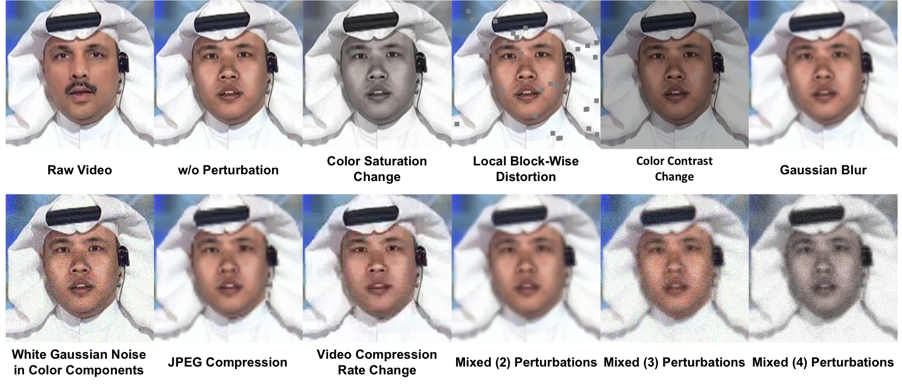

# Perturbation Implementation in DeeperForensics-1.0

<p align="center"></p>

This is a tutorial for using our perturbation codes.


## Dependencies
* FFmpeg with the H.264 and XVID codec
* python 3
* opencv-python
* numpy
* tqdm


## Installation
Please first install FFmpeg with the H.264 and XVID codec
for your operating system, following this
[official guide](https://trac.ffmpeg.org/wiki/CompilationGuide).

Then, we recommend you to create a new conda environment with
python 3. After installing [Anaconda 3](https://www.anaconda.com/),
you can run the following command:
```bash
conda create -n ptb python=3.7 -y
conda activate ptb
```
Finally, clone our repo and install other dependencies via pip:
```bash
git clone https://github.com/EndlessSora/DeeperForensics-1.0.git
cd DeeperForensics-1.0/perturbation/
pip install -r requirements.txt
```


## Usage
### Apply a distortion to video
You can apply **7** types of perturbations at **5** intensity levels mentioned in
our [paper](https://arxiv.org/abs/2001.03024) to a video. We also provide the
[distortion meta files](../dataset/README.md#lists) of our dataset. Following
this tutorial, you can easily reproduce the perturbed videos.


#### For a quick start
We put a video example `data/input.mp4`, you can simply run:
```bash
bash scripts/run.sh
```
or:
```bash
bash scripts/run_via_xvid.sh
```
Please see [scripts/run.sh](./scripts/run.sh) or
[scripts/run_via_xvid.sh](./scripts/run_via_xvid.sh) for details. The script will
apply `random`-type `random`-level distortion to the input video, and generate an
output video at `results/output.mp4`, as well as a meta file at `metas/meta.txt`.


#### Arguments
We run `add_distortion_to_video.py` to apply a distortion to video.
For its argument details, please read the [argument explanation](./ARGUMENTS.md#add_distortion_to_videopy).
**Note:** if you would like to **strictly** align with the distortions in our dataset,
**please add** `--via_xvid` **in your command.** You can also find the reason in
the [argument explanation](./ARGUMENTS.md#add_distortion_to_videopy).


#### Mixed distortions
If you want to add **mixed** distortions to a single video, just simply run our code
by multiple times (**remember to change** `--vid_in`, and you can use the meta history
to avoid adding repeated distortions to a single video).


### Check video information
We recommend you to check that some necessary information of the output video
remains unchanged after you apply distortions. This will reduce potential errors
in the further process.


#### For a quick start
After run `scripts/run.sh` or `scripts/run_via_xvid.sh`, you can simply run:
```bash
bash scripts/check.sh
```
Please see [scripts/check.sh](./scripts/check.sh) for details.
If you encounter `AssertionError`, then your output video has some problems. You may
need to fix the problems by re-applying the distortion. If you can see an output log
saying 'No problem.', feel free to further process the video as you like.

#### Arguments
We run `check_video.py` to check video information. For its argument details,
please read the [argument explanation](./ARGUMENTS.md#check_videopy).
